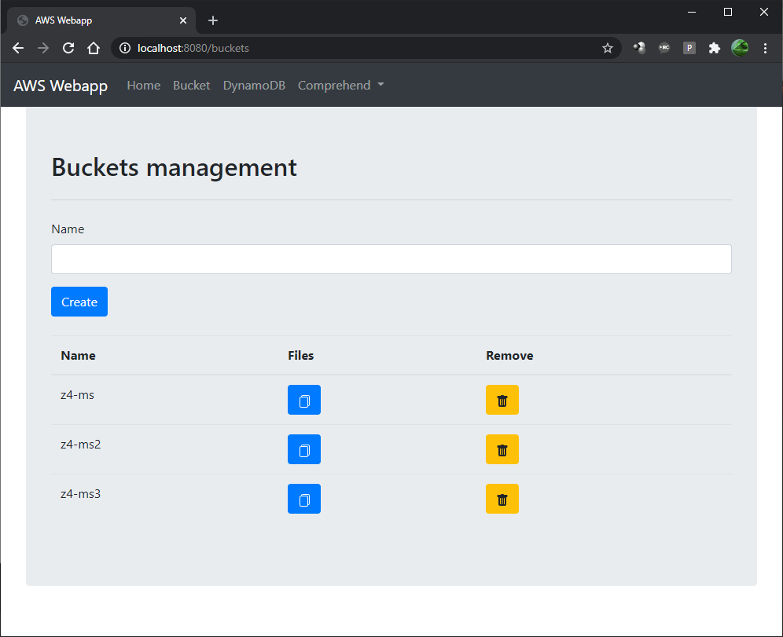
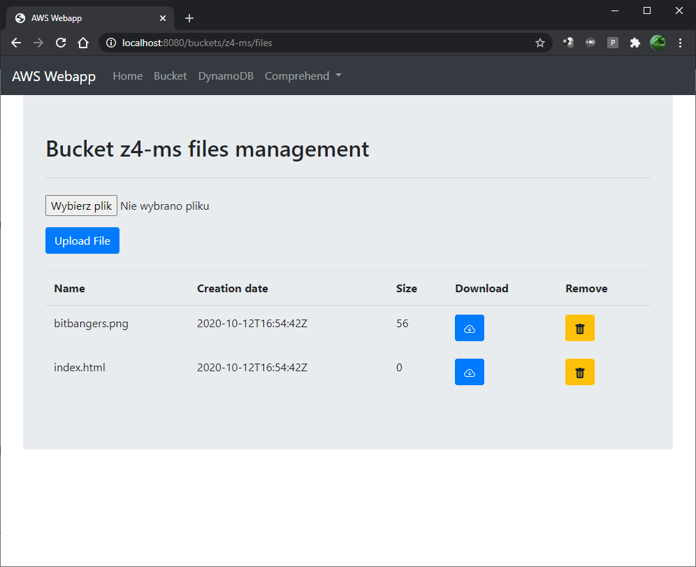
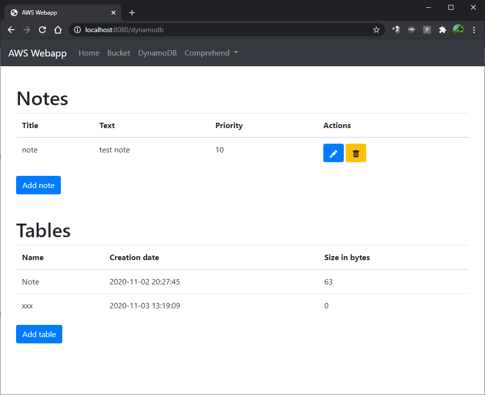
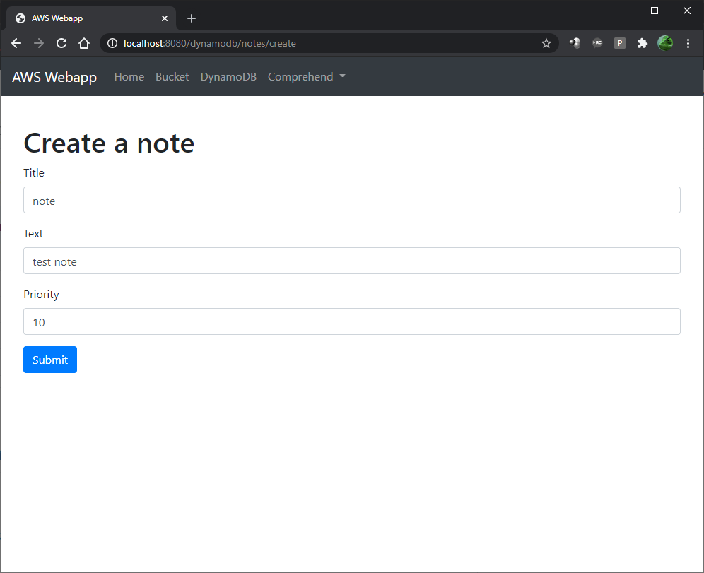
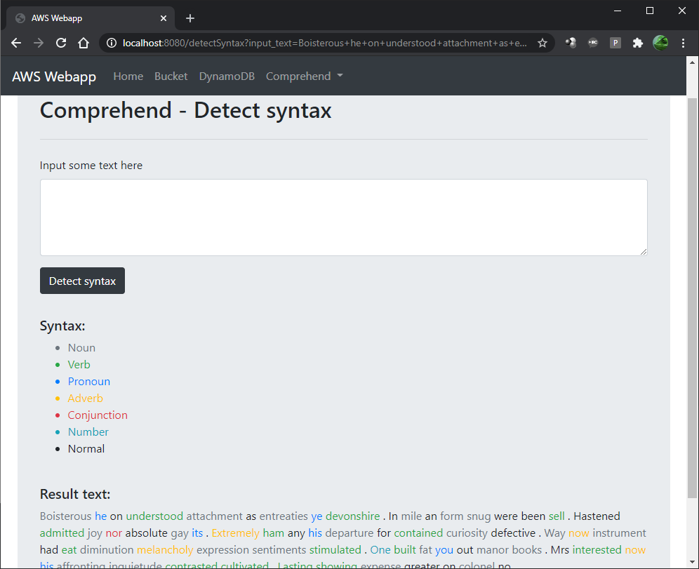
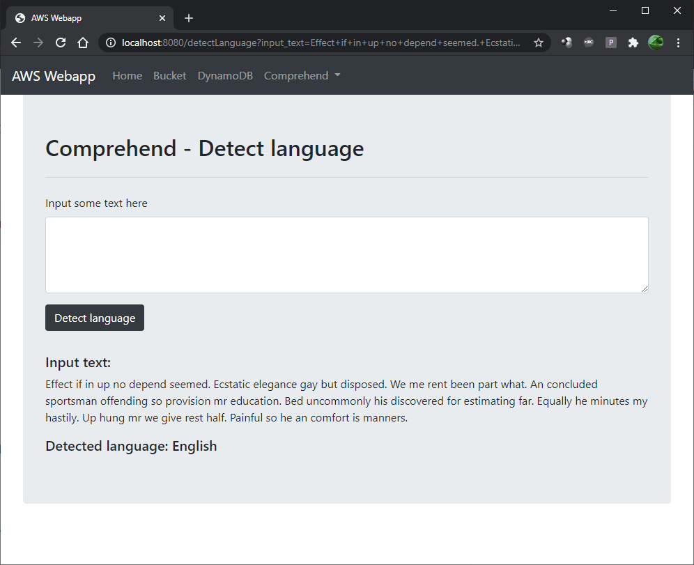

# Spring Boot application with AWS SDK

## Info

In app have been used AWS Services:
- [S3](https://aws.amazon.com/s3/?nc2=h_ql_prod_fs_s3)
- [DynamoDB](https://aws.amazon.com/dynamodb/?nc2=h_ql_prod_fs_ddb)
- [Comprehend](https://aws.amazon.com/comprehend/?nc2=h_ql_prod_ml_comp)

## Prepare

Launch the following command.

 ```sh
 $ mvn install
```

Create your credentials file at ~/.aws/credentials (C:\Users\USER_NAME\\.aws\credentials for Windows users) and save the following lines after replacing the values with your own.

```sh
[default]
aws_access_key_id = YOUR_ACCESS_KEY_ID
aws_secret_access_key = YOUR_SECRET_ACCESS_KEY
```

## Run

Launch the following commands.

```sh
 $ mvn spring-boot:run
 ```

Your app should be up and running on port 8080. 
 
Open http://127.0.0.1:8080 in your browser and you should see Home Page.
 
## Screenshots

### S3

#### Buckets management


#### Files management


### DynamoDB

#### Tables with notes


#### Add note


### Comprehend

#### Syntax detection


#### Language detection
